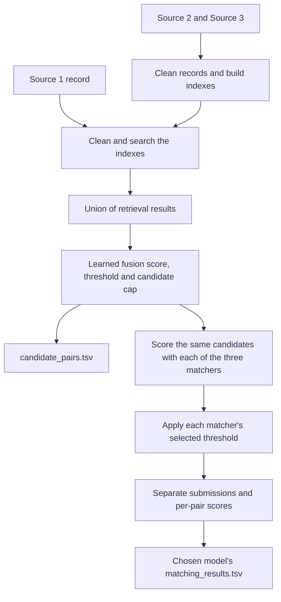

# Business Entity Resolution Challenge

This README explains how to run the project, what happens at each stage, which parameters are learned, and how to analyse the results. The implementation is in [`code/business_entity_resolution/`](code/business_entity_resolution/README.md).

**The complete pipeline cleans the data, generates candidates, learns candidate-selection weights, trains three separate matching models, tunes hyperparameters and thresholds, and writes both required submission files.** It saves results as TSV tables so we can decide later whether combining models is worthwhile. It does not automatically build an ensemble.

No challenge dataset is included. The code has been checked using synthetic records and tiny local transformers; those checks establish that the software runs, not that a particular model is accurate on the challenge.

## Contents

- [What the problem and outputs mean](#what-the-problem-and-outputs-mean)
- [Setup and dataset layout](#setup-and-dataset-layout)
- [Commands to run the project](#commands-to-run-the-project)
- [What happens during a complete run](#what-happens-during-a-complete-run)
- [Step 1: cleaning](#step-1-cleaning)
- [Step 2: train, tune and audit splits](#step-2-train-tune-and-audit-splits)
- [Step 3: five retrieval techniques and indexes](#step-3-five-retrieval-techniques-and-indexes)
- [Step 4: learned candidate selection](#step-4-learned-candidate-selection)
- [Step 5: matching features and three classifiers](#step-5-matching-features-and-three-classifiers)
- [What learns weights versus what gets tuned](#what-learns-weights-versus-what-gets-tuned)
- [Hyperparameter search and configuration](#hyperparameter-search-and-configuration)
- [Scoring, model selection and final refitting](#scoring-model-selection-and-final-refitting)
- [Reports and how to analyse them](#reports-and-how-to-analyse-them)
- [Submission files, validation and packaging](#submission-files-validation-and-packaging)
- [Code map, verification and troubleshooting](#code-map-verification-and-troubleshooting)

## What the problem and outputs mean

Source 1 is the deduplicated reference list. For each Source 1 record, find **all** records in Sources 2 and 3 representing the same real business. There can be zero, one or many matches, including multiple matches within the same source.

For example, suppose these are records of the same business:

```text
S1-001: Orion Technologies Private Limited, 12 MG Road, Pune
S2-011: Orion Technologies Pvt Ltd,         12 MG Rd, Pune
S3-021: Orion Tecnologies,                 12 MG Road, Pune
```

A similar-looking record such as `Orion Foods, 84 Lake Road, Pune` may be worth inspecting but is not automatically the same business. The pipeline therefore has two different decisions:

| Stage | Question | Result |
|---|---|---|
| Candidate generation / retrieval | Which records are plausible enough to inspect carefully? | A small shortlist per Source 1 record |
| Final matching | Which shortlisted records actually represent the same business? | Accepted matches, or an empty list |

The final shortlist goes into `candidate_pairs.tsv`. The accepted matches go into `matching_results.tsv`. Every accepted match must have appeared in the shortlist. **Retrieval is the first stage; the final matcher is the second stage. RAG is not required or implemented.**

## Setup and dataset layout

Run all commands from this repository's root: the folder containing this README and `code/`. Use Python 3.12; the pinned dependencies support Python 3.11–3.12.

For a fresh setup:

```sh
python3 -m venv .venv
source .venv/bin/activate
python -m pip install -r code/business_entity_resolution/requirements.txt
python -m pip install -e code/business_entity_resolution --no-deps
```

If this environment is already installed, activate it with `source .venv/bin/activate`. The installation provides the `ber` command. `python -m ber` is an equivalent way to invoke it from the activated environment.

Place the seven challenge files here when available:

```text
dataset/
├── train/
│   ├── train_source1.tsv
│   ├── train_source2.tsv
│   ├── train_source3.tsv
│   └── train_ground_truth.tsv
└── test/
    ├── test_source1.tsv
    ├── test_source2.tsv
    └── test_source3.tsv
```

Each source file needs `entity_id`, `business_name`, `business_address`, and `country`. Ground truth needs `source1_entity_id` and `matched_entity_ids`, with comma-separated matches or an empty field. Columns must be separated by tabs, not commas.

For the full neural experiment, download the pretrained model weights once:

```sh
ber download-models --directory models
```

This creates `models/multilingual-minilm/` using `sentence-transformers/paraphrase-multilingual-MiniLM-L12-v2`. The command verifies the declared Apache-2.0 licence and records the exact model revision and file hashes. It downloads model weights, not business records. Training and inference then use local files; they do not query business databases, geocoding services, or hosted embedding APIs.

The retrieval encoder and cross-encoder start from this same base checkpoint, but train separately. The cross-encoder gets a new classification head that must learn from our matching labels. Model paths in YAML are relative to the working directory. Keep the initial model directory until submission packaging because it is included for reproducible retraining.

## Commands to run the project

### Full experiment: all five retrieval routes and all three matchers

```sh
ber run --data-dir dataset \
  --config code/business_entity_resolution/configs/default.yaml \
  --run-dir runs/experiment_001
```

This performs retrieval search, matcher search, held-out evaluation, final refitting and test prediction. Use a new run directory for each experiment. Progress is printed and saved in `runs/experiment_001/run.log`; completed trial reports are written as the run proceeds.

### Train and evaluate before the test files arrive

```sh
ber run --data-dir dataset \
  --config code/business_entity_resolution/configs/default.yaml \
  --run-dir runs/train_only_001 \
  --train-only
```

This still needs the four training files and the downloaded neural checkpoint. It trains and saves models but does not generate test submissions. When the test files arrive, use the saved artifacts:

```sh
ber predict --data-dir dataset \
  --artifacts runs/train_only_001/artifacts \
  --output-dir runs/test_predictions_001
```

### Smaller classical baseline

```sh
ber run --data-dir dataset \
  --config code/business_entity_resolution/configs/quick.yaml \
  --run-dir runs/classical_001
```

`quick.yaml` explicitly disables embedding retrieval and the cross-encoder. It uses four retrieval routes, logistic regression and boosted trees, with smaller search budgets. It does not need downloaded neural weights. Use `default.yaml` for the full comparison we planned.

### Test the code without the real dataset or pretrained weights

```sh
ber smoke --directory runs/smoke_local \
  --config code/business_entity_resolution/configs/default.yaml

python -m pytest code/business_entity_resolution/tests -q
```

The smoke command generates invented records and a tiny random transformer, then runs all five retrieval routes and all three matchers with reduced search settings. It performs real gradient updates, prediction and submission validation. Its results are software checks, **not estimates of competition accuracy**. Use a new smoke directory if that path already exists.

### Replay a completed experiment without retraining

```sh
ber predict --data-dir dataset \
  --artifacts runs/experiment_001/artifacts \
  --output-dir runs/replay_001
```

Replay rebuilds indexes over the supplied test Sources 2/3 using the saved transformations, retrieves candidates for test Source 1, and applies the saved matchers and thresholds. Test data passes through **both retrieval and matching**. It does not need test labels or another pretrained-model download. Add `--device cpu`, `--device mps`, or `--device cuda` when appropriate.

## What happens during a complete run

The training/evaluation process is:

```text
Read and validate training TSVs
  → clean records and inspect missing fields
  → split Source 1 entities into train / tune / audit
  → compare retrieval representations and index settings
  → learn five-route candidate weights on training labels
  → choose candidate threshold and cap using tuning recall/counts
  → train each matching classifier with different hyperparameters
  → choose each classifier's acceptance threshold using tuning F0.5
  → evaluate the selected version of each classifier on audit
  → choose the submission model using tuning results only
  → refit selected settings on all labelled records, if enabled
  → run test retrieval and all three test matchers
  → validate and save submissions and reports
```

At inference, each Source 1 record follows this flow:



## Step 1: cleaning

The loader reads strings with `sep="\t"` and keeps empty strings and leading zeroes. It checks ID prefixes, duplicates, required columns and training-label coverage.

The cleaner creates additional representations while retaining the original fields:

| Transformation | Example / purpose |
|---|---|
| Unicode normalisation and case folding | Standardise equivalent text forms and case |
| Whitespace and punctuation handling | `Orion   Tools` and `ORION Tools` become comparable |
| Legal abbreviation expansion | `Pvt. Ltd.` becomes `private limited` |
| Core business name | Remove trailing legal terms in an extra comparison field |
| Latin accent folding | `Étoile` also gets an `etoile` lookup form; Indic combining marks are preserved |
| Conservative street expansion | `Rd` becomes `road`; ambiguous `St` is not globally expanded |
| Address component extraction | Derive tentative postal code, leading house number and unit |
| Missing-field indicators | Distinguish “postal code unavailable” from “postal codes disagree” |

No address lookup or geocoding is performed. Extracted components can be uncertain and are treated as evidence. Different house numbers are preserved rather than cleaned into the same value.

Country handling accepts open string labels. There is no US/India-only one-hot encoding or hard country filter on text/embedding retrieval. France and any other country remain eligible for prediction. Postal parsing uses a few country hints plus an unknown-country fallback; this does not guarantee perfect address parsing or accuracy on unseen countries.

## Step 2: train, tune and audit splits

The default proportions are approximately **60% train, 20% tune, 20% audit**, split by Source 1 entity rather than individual pairs. Small strata and shared-target groups can change the exact counts; `reports/splits.tsv` records the actual assignment.

| Partition | What it is used for |
|---|---|
| Train | Fit TF-IDF statistics, candidate coefficients, optional embedding fine-tuning and matching models |
| Tune | Choose retrieval settings, shortlist policy, model hyperparameters and final thresholds |
| Audit | Evaluate the chosen configurations without changing the automatic selections |
| Test | Generate candidates and matches using the fitted pipeline; no test labels are used |

If anchors share a labelled target, they stay in the same partition. Known tune/audit businesses are excluded from supervised negative examples as well as train-only representation fitting. All target records can still be indexed and searched as competitors during evaluation; indexing an unlabeled record does not make it a training example.

The audit provides a held-out check for this experiment. Repeatedly adjusting the system using audit results would turn it into another development set.

## Step 3: five retrieval techniques and indexes

An index is a prepared structure that avoids rescanning every target record for every query. The same fitted vectorizer or encoder transforms both Source 1 queries and Source 2/3 targets.

Consider this illustrative collection; `A`, `B`, `C`, `D` stand for real target IDs:

| Target | Name | Address |
|---|---|---|
| A | Orion Technologies Pvt Ltd | 12 MG Road, Pune, 411001 |
| B | Orion Tecnologies | 12 MG Rd, Pune |
| C | OT Private Limited | 12 MG Road, Pune, 411001 |
| D | Orion Foods | 84 Lake Road, Pune, 411001 |

For Source 1 = `Orion Technologies, 12 MG Road, Pune, 411001, India`, the routes work as follows. These are schematic examples, not measured rankings.

| Route | What the index stores | How the query retrieves candidates |
|---|---|---|
| Name character TF-IDF | Fragment → `(record, weight)` entries; e.g. `tec → A,B`, `ori → A,B,D` | Look up shared fragments and accumulate weighted similarity. The typo in B can still retain many shared fragments. |
| Name word TF-IDF | Word → weighted record entries; e.g. `orion → A,B,D` | Look up name words and rank by their weighted overlap. Word order and legal additions need not match exactly. |
| Address TF-IDF | Address word or character fragment → weighted entries; e.g. `mg → A,B,C` | Search independently of the name. This can recover C despite its abbreviation. |
| Exact composite keys | Dictionary keys such as `("india", "411001", "12") → A,C` | Direct lookup using country/postal/house, country/core name, or country/address where enough information exists. |
| Embeddings + HNSW | Normalised vectors and graph links to nearby vectors | Encode the whole query record and navigate the graph to retrieve nearby target vectors. This may recover more complex variations. |

Character fragments of `technologies` and `tecnologies` share pieces such as `tec`, `nol`, `log`, `ogi` and `ies`. They do not have to become the same string or get the same exact index key.

The dense route compares two variants: the frozen pretrained encoder and an encoder fine-tuned on training positives and lexical hard negatives. Fine-tuning encourages matching vectors to be closer and nonmatching vectors to be farther apart. An embedding score alone is not proof of identity.

### How lookup work stays bounded

The text routes use weighted inverted indexes. A query visits at most `max_query_terms` terms; posting lists exceeding `max_posting` are skipped. Thus, posting visits per text route are bounded by their product. Top-k selection follows accumulation of the touched records' scores. Oversized exact-key blocks are also skipped and counted.

These limits can lose true matches, so their effect is measured using validation recall. Within the retrieved union, full sparse similarities are recomputed for the candidate records. No full dense Source 1 × Source 2/3 similarity matrix is built.

HNSW performs approximate graph search; its search effort, graph size and construction settings trade speed and memory against recall. Its lookup is not a guaranteed constant-time operation. Index construction still needs to read and encode the targets once.

Target indexes and training tables live in memory. Test queries are batched. This is a single-machine challenge implementation, not a distributed system for billions of records; inspect the work and runtime reports on the actual dataset.

## Step 4: learned candidate selection

The routes first return a union of possible targets. Duplicate IDs are removed. Each pair receives five route scores, then the fusion model calculates:

```text
z = bias
    + w_char × name_character_score
    + w_word × name_word_score
    + w_address × address_score
    + w_exact × exact_key_evidence
    + w_embedding × embedding_score

candidate_score = sigmoid(z)
```

`sigmoid` converts the value into a score between 0 and 1. The five coefficients are learned from train-pair labels, constrained to be nonnegative, and regularised to discourage overly large values. Their sum is not constrained to one. An intercept is learned too. Training gives each query equal aggregate weight so a query with many candidates does not dominate just because it has more pairs.

For each Source 1 entity, the selector:

1. Removes pairs below the candidate-score threshold.
2. Sorts the remaining pairs by score.
3. Keeps at most the selected candidate cap.

The tuning target is **high recall with small shortlists**. The default requires at least 0.99 candidate recall both across true pairs and averaged over entities that have true matches. Among configurations satisfying those targets, it chooses the smallest average shortlist. If none succeed, it selects the best achieved recall and logs a warning; a completed run does not imply that the recall targets were reached.

The resulting list is the input to the final matching models and is what goes into `candidate_pairs.tsv`. If a true match is excluded here, the final matcher cannot recover it.

### Three different threshold decisions

| Setting | Where it acts | Purpose |
|---|---|---|
| Retrieval minimum similarity and `route_k` | Inside each similarity-search route | Limit that route's initial results |
| Fusion threshold and candidate cap | After combining the routes | Choose the final shortlist |
| Matching acceptance threshold | After each final classifier scores the shortlist | Decide which records to report as actual matches |

These thresholds are separate hyperparameters. Learning a model's coefficients is different from choosing its acceptance threshold.

## Step 5: matching features and three classifiers

### Features for logistic regression and boosted trees

For each `(Source 1, candidate)` pair, the code calculates:

| Evidence | What it measures |
|---|---|
| Separate TF-IDF scores and embedding cosine | Name, address and representation similarity |
| Normalised Levenshtein similarity | Small insertions, deletions or substitutions |
| Jaro–Winkler similarity | Another character-comparison signal, with emphasis on shared prefixes |
| Token Jaccard and containment | Shared words, including reordered or partially missing names |
| Exact full/core/accent-folded name agreement | Different levels of name normalisation |
| Acronym and length-ratio features | Possible abbreviations and name-length differences |
| Address edit, token and exact agreement | Address-level similarity |
| Postal, house, unit and country comparisons | Separate agreement, conflict and missing-value indicators |
| Name–address interaction and retrieval score | Combined evidence and the earlier retrieval model's score |

These comparisons become numerical features; the comparison formulas themselves do not learn supervised weights. The classifier learns how to use them. IDs are not predictive features, and no fixed rule says the name must always matter more than the address.

### The three models

| Model | Input | What training learns |
|---|---|---|
| Logistic regression | Standardised pair features | One coefficient per feature and an intercept |
| Histogram gradient-boosted trees | Pair features | Tree splits, leaf predictions and conditional interactions |
| Cross-encoder | Both original records together, including name, address and country | Transformer parameters and a binary classification head |

The cross-encoder reads both records jointly; it does not take the handcrafted feature table as its input. For example, it sees the pair `Orion Technologies, 12 MG Road` and `Orion Tecnologies, 12 MG Rd` together and learns an identity score from labels.

The tree model can learn that the useful evidence changes with circumstances, such as a missing address or a conflicting unit number. It does not have one global coefficient called “name importance.” The code reports its tuning-set permutation importance instead: how much the score drops when a feature is shuffled. Correlated features can make this measure harder to interpret.

### Training pairs versus inference candidates

Matchers train on a **broader raw retrieval pool from training entities**. They keep all retrieved positives and up to 40 negatives per anchor by default, mixing high-scoring hard negatives with randomly sampled negatives. A hard negative looks plausible but is labelled as a different business. Singleton entities also supply negatives.

This matters because a strong candidate filter might remove almost every negative. A classifier still needs examples of incorrect pairs to learn rejection. Known held-out businesses are not used even as supervised negatives.

Tune, audit and test inference use only the final filtered shortlist. All three models score exactly that same set. Their scores are thresholded independently, allowing multiple accepted matches or an empty list. Neither a retrieved neighbour nor a high cosine score is automatically accepted as a match.

## What learns weights versus what gets tuned

| Component | Weight learning | Hyperparameters / settings |
|---|---|---|
| Cleaning | None | Normalisation rules in code |
| TF-IDF | Frequency statistics from training text, not match labels | N-gram lengths, representation and vocabulary size |
| Inverted indexes and exact keys | None | Posting limits, query-term limits, block limits and top-k |
| Retrieval encoder | Optional fine-tuning on labelled pairs | Epochs, learning rate, batch settings, loss settings |
| HNSW index | No supervised identity-weight learning | Graph degree and construction/search effort |
| Candidate fusion | Five nonnegative coefficients and an intercept | L2 strength, candidate threshold and cap |
| Logistic matcher | Feature coefficients and intercept | `C`, class weighting and acceptance threshold |
| Tree matcher | Tree structure and predictions | Learning rate, iterations, leaf settings, L2 and acceptance threshold |
| Cross-encoder matcher | Transformer and classification-head parameters | Learning rate, epochs, batch settings, weight decay and acceptance threshold |

Learned coefficients are fitted on training labels. Hyperparameters and thresholds are selected using tuning performance. TF-IDF calling `fit()` means calculating text statistics, not learning from matching/nonmatching labels.

## Hyperparameter search and configuration

The authoritative settings are in [`configs/default.yaml`](code/business_entity_resolution/configs/default.yaml). `retrieval.base` supplies baseline values; a retrieval trial overrides the keys listed in `retrieval.grid`. A grid entry with only one value is fixed for that run, even though it can be changed for another experiment.

### Default search

| Search | Values explored | Trial budget |
|---|---|---|
| Retrieval settings | Character minimum 2/3 and maximum 4/5; word/character address representation; route-k 15/40; posting cap 1,000/5,000; query terms 32/64; minimum similarity 0.02/0.1; fusion L2 0.0001/0.01; HNSW search effort 60/120 | 8 sampled combinations |
| Retrieval embeddings | Frozen (`epochs: 0`) versus fine-tuned for 1 epoch | 2 variants |
| Candidate policy | Thresholds 0, 0.05, 0.15, 0.3; total candidate caps 10, 25, 50 | 12 policies per retrieval/embedding combination |
| Logistic regression | `C`: 0.1, 1, 10; class weighting: none or balanced | 6 configurations |
| Boosted trees | Learning rate 0.05/0.1; iterations 150/300; leaf count 15/31; minimum leaf size 10/30; L2 0/1 | 12 sampled configurations |
| Cross-encoder | Learning rate 0.00002/0.00005; epochs 1/2 | 4 configurations |
| Matching threshold | Configured thresholds from 0.05 through 0.995, plus 0 and a predict-none option | Tested for every matching trial |

Thus the default evaluates 8 × 2 retrieval/embedding combinations, each with 12 candidate policies, then 22 matching-model configurations against the selected candidate pipeline. Candidate-weight fitting is reused across policy thresholds/caps within a retrieval trial. Final refitting is additional work beyond these search trials.

Search is seeded with `seed: 42`. When a grid is larger than `max_trials`, the code includes the first combination and samples the remainder reproducibly. It does not promise exhaustive search or a global optimum.

Other important configurable settings include:

| Setting | Default | Meaning |
|---|---:|---|
| `query_batch_size` | 128 | Test Source 1 records handled per prediction batch |
| `final_refit` | `true` | Refit chosen settings on all labelled data after audit |
| `retrieval.base.max_features` | 200,000 | Vocabulary cap per TF-IDF representation |
| `retrieval.base.max_exact_block` | 100 | Skip exact-key lists larger than this |
| `retrieval.base.hnsw_m` | 24 | HNSW graph degree setting |
| `embedding.negatives_per_anchor` | 8 | Negative-sampling cap for embedding training |
| `matching.max_negatives_per_anchor` | 40 | Negative-sampling cap for matcher training |
| `embedding.max_length` / `cross_encoder.max_length` | 128 / 256 | Token-length limits |
| `embedding.batch_size` / `cross_encoder.batch_size` | 16 / 8 | Inference batch sizes; training also has grid batch settings |
| Cross-encoder training accumulation | 2 | Accumulate gradients across two minibatches before updating |

Some settings are in the search grid and others are constants. Raising a constant does not automatically trigger a sweep. To explore another training batch size, for example, add it to that model's training grid. If training memory is tight, reduce the training grid's `batch_size` as well as the relevant inference batch size.

To make your own experiment without losing the baseline:

```sh
cp code/business_entity_resolution/configs/default.yaml \
  code/business_entity_resolution/configs/my_experiment.yaml
```

Edit that copy, then run:

```sh
ber run --data-dir dataset \
  --config code/business_entity_resolution/configs/my_experiment.yaml \
  --run-dir runs/experiment_002
```

For example, increasing `route_k` or candidate caps may recover more matches but increase work. Increasing `max_trials` tests more combinations. The full neural search can be expensive; the actual runtime and memory demand must be measured on the real dataset. SVM and Naive Bayes are not part of the current implementation.

## Scoring, model selection and final refitting

For each Source 1 entity, count:

- **TP:** correctly predicted matches.
- **FP:** incorrectly accepted matches.
- **FN:** true matches that were missed, including those lost during retrieval.

The challenge score for that entity is:

```text
F0.5 = 5 × TP / (5 × TP + 4 × FP + FN)
```

Empty truth plus empty prediction scores 1. An entity with no true matches scores 0 if any match is predicted. The final score averages over Source 1 entities, including singletons. It is not the macro average over binary pair classes.

The code selects each model's hyperparameters and threshold using tuning macro F0.5. It evaluates the selected version of each family on audit, and picks the submission family using tuning results only. Audit results do not silently select the winner. Ties prefer fewer false positives.

With `final_refit: true`, the selected hyperparameters and thresholds stay fixed while the pipeline refits TF-IDF statistics, candidate coefficients and selected matching models on all labelled training records. If a fine-tuned embedding variant was selected, it is retrained on all labelled data too. Test indexes are then built over test Sources 2/3.

**Audit scores describe the pre-refit models.** Full refitting can shift scores relative to the fixed thresholds. Set `final_refit: false` if you want test predictions from the fitted models used in the held-out comparison.

## Reports and how to analyse them

A completed run has this structure:

```text
runs/experiment_001/
├── config.json
├── manifest.json
├── run.log
├── reports/
├── evaluation_artifacts/      # Models used for tune/audit comparisons
├── artifacts/                 # Final models and transformations for replay
└── output/
    ├── candidate_pairs.tsv
    ├── matching_results.tsv
    ├── validation.json
    ├── selection.json
    ├── retrieval_work.tsv
    └── models/
        ├── logistic/
        ├── boosted_trees/
        └── cross_encoder/
```

The per-model output directories each contain `candidate_pairs.tsv`, `matching_results.tsv`, and `pair_scores.tsv`. The top-level matching file uses the selected model. All models share the same final candidates.

### Report reference

Paths below are relative to the run directory:

| File | What it tells you |
|---|---|
| `config.json`, `manifest.json`, `run.log` | Exact settings, input hashes, dependency versions, run status and progress |
| `reports/data_profile.tsv`, `reports/splits.tsv` | Missing fields, country coverage and entity split assignments |
| `reports/cleaned_source1.tsv.gz`, `reports/cleaned_targets.tsv.gz` | Original and cleaned fields side by side |
| `reports/retrieval_trials.tsv` | Every tested candidate policy, recall, shortlist size, reduction and runtime |
| `reports/retrieval_weights.tsv` | Learned five-route coefficients and intercept for each retrieval trial |
| `reports/embedding_training.tsv` | Embedding fine-tuning loss by epoch |
| `reports/candidate_summary.tsv`, `reports/candidate_entities.tsv` | Candidate recall and counts by split/entity, plus the achievable matching-score ceiling |
| `reports/route_ablation.tsv` | Standalone coverage of the records returned by each retrieval route |
| `reports/retrieval_misses.tsv` | Whether a missed true match was lost in raw retrieval or later fusion/capping |
| `reports/retrieval_work.tsv` | Posting visits, skipped terms, oversized exact blocks, timing and route counts |
| `reports/candidate_pairs_long.tsv.gz` | Filtered pairs with route scores, route-presence flags and candidate scores |
| `reports/training_pairs.tsv.gz`, `reports/features/*.tsv.gz` | Training examples and actual feature values; `final_train` is written after full refit |
| `reports/model_trials.tsv`, `reports/threshold_trials.tsv` | All model hyperparameter trials and threshold evaluations |
| `reports/model_comparison.tsv` | Tune/audit macro F0.5, precision, recall, false positives, singletons and prediction time |
| `reports/country_scores.tsv` | Performance broken down by country |
| `reports/scores/*.tsv.gz` | Per-pair scores for individual trials and selected models |
| `reports/entities/*.tsv`, `reports/errors/*.tsv` | Entity scores, false positives, matching misses and retrieval misses |
| `reports/comparison_pairs_tune.tsv.gz`, `reports/comparison_pairs_audit.tsv.gz` | Aligned scores and decisions from all three models |
| `reports/model_disagreements.tsv` | Which models correct each other's mistakes and where both are wrong |
| `reports/boosted_tree_permutation_importance.tsv` | Feature importance measured by shuffling tuning features, when enabled |
| `reports/training/*.tsv` | Cross-encoder training losses, including final refit when enabled |
| `reports/final_retrieval_weights.tsv`, `reports/final_refit_candidate_metrics.tsv` | Candidate weights and descriptive training metrics after full refit |
| `reports/selected_retrieval.json`, `reports/selected_matchers.json`, `reports/selected_model.json` | The selected settings and submission family |
| `artifacts/logistic/feature_weights.tsv` | Final logistic coefficients and feature-scaling values |

The model weights themselves are also saved: classical models/transformations in Joblib files and neural weights in Safetensors. Millions of neural parameters are not expanded into TSV rows. Logistic intercepts are stored with the model and in its `intercept.json`.

### Suggested analysis order

1. Inspect `candidate_summary.tsv`. If retrieval recall is low, changing the final classifier cannot recover those missing records.
2. Inspect `retrieval_misses.tsv` and `route_ablation.tsv` to see whether a route, fusion threshold, or candidate cap is responsible.
3. Inspect `model_comparison.tsv`, especially audit macro F0.5, false positives and singleton accuracy.
4. Inspect `country_scores.tsv` and the error tables for specific failure patterns.
5. Inspect `model_disagreements.tsv` and aligned pair scores to judge whether the models provide complementary evidence.

You can open compressed TSVs directly with pandas:

```python
from pathlib import Path
import pandas as pd

reports = Path("runs/experiment_001/reports")
comparison = pd.read_csv(reports / "model_comparison.tsv", sep="\t")
pair_scores = pd.read_csv(reports / "comparison_pairs_audit.tsv.gz", sep="\t")
print(comparison.to_string(index=False))
print(pair_scores.head())
```

No ensemble is currently trained. A later weighted average or stacking model should use grouped out-of-fold predictions or a separate development split to learn its weights, with an independent evaluation set. Do not fit ensemble weights on the audit labels and then report that same audit score as an unbiased result. Also check probability calibration before averaging the different model scores.

## Submission files, validation and packaging

The required files are:

```text
runs/experiment_001/output/matching_results.tsv
  columns: source1_entity_id, matched_entity_ids

runs/experiment_001/output/candidate_pairs.tsv
  columns: source1_entity_id, candidate_entity_ids
```

Those column-name lists are explanatory: the actual files use **tabs between columns** and commas inside ID lists. Both files contain exactly one row per test Source 1 ID, including unknown countries and entities with empty lists. Listed IDs must be distinct valid Source 2/3 test IDs.

`candidate_pairs.tsv` is the exact set scored by each final matching classifier, after retrieval fusion and filtering. It is not the larger raw retrieval pool or the broader pool used for matcher training. The output validator checks that every accepted match belongs to this set.

Validation happens automatically after test prediction. To run the independent standard-library validator yourself:

```sh
python code/business_entity_resolution/utils/validate_submission.py \
  --matching runs/experiment_001/output/matching_results.tsv \
  --candidate runs/experiment_001/output/candidate_pairs.tsv \
  --test-dir dataset/test
```

It prints `PASS` for a valid submission. It checks formatting and IDs; it does not measure accuracy. Also use the organiser's validator when it is supplied.

To build the final package from a complete run that generated test outputs:

```sh
ber package --run-dir runs/experiment_001 \
  --data-dir dataset \
  --output team_submission.zip
```

The archive contains:

```text
output/
  matching_results.tsv
  candidate_pairs.tsv
code/business_entity_resolution/
  src/
  README.md
  requirements.txt
  configs/
  artifacts/
  base_models/
  reproduce.yaml
Documentation_template.md
REPRODUCE.md
reports/
run_manifest.json
```

Saved trained models support offline inference replay. The original neural checkpoints are also packaged so complete training can be reproduced using the supplied dataset. A full neural archive may therefore be large. The project includes a methodology document covering the requested topics; the organiser's original template was not supplied, so transfer the write-up into it if different headings are required.

## Code map, verification and troubleshooting

### Where each part lives

| File | Responsibility |
|---|---|
| [`cli.py`](code/business_entity_resolution/src/ber/cli.py) | Run, predict, validate, download, smoke and package commands |
| [`config.py`](code/business_entity_resolution/src/ber/config.py) and [`default.yaml`](code/business_entity_resolution/configs/default.yaml) | Configuration loading, checks and search settings |
| [`data.py`](code/business_entity_resolution/src/ber/data.py) | TSV loading, ID validation and output helpers |
| [`cleaning.py`](code/business_entity_resolution/src/ber/cleaning.py) | Normalisation and address-component extraction |
| [`split.py`](code/business_entity_resolution/src/ber/split.py) | Entity-group train/tune/audit separation |
| [`retrieval.py`](code/business_entity_resolution/src/ber/retrieval.py) | TF-IDF indexes, exact keys, HNSW and learned candidate fusion |
| [`features.py`](code/business_entity_resolution/src/ber/features.py) | Pair comparisons, labels and negative sampling |
| [`neural.py`](code/business_entity_resolution/src/ber/neural.py) | Local embedding/cross-encoder training, encoding and scoring |
| [`models.py`](code/business_entity_resolution/src/ber/models.py) | Three classifier wrappers and saved-model loading |
| [`metrics.py`](code/business_entity_resolution/src/ber/metrics.py) | Exact challenge score, candidate metrics and threshold search |
| [`pipeline.py`](code/business_entity_resolution/src/ber/pipeline.py) | Experiment orchestration, report writing, refitting and inference |
| [`packaging.py`](code/business_entity_resolution/src/ber/packaging.py) | Reproducible ZIP assembly |
| [`synthetic.py`](code/business_entity_resolution/src/ber/synthetic.py) | Invented records and tiny transformer fixtures |
| [`tests/`](code/business_entity_resolution/tests) | Unit and complete-pipeline verification |

### What has been verified

The implementation verification recorded **14 passing tests**. They check metric/singleton behaviour, typo retrieval, open countries, Unicode handling, train/audit isolation, candidate weight learning, all three actual model-training paths, neural parameter updates, output rules, saved-model replay, and complete retraining from an extracted archive.

See [VERIFICATION.md](code/business_entity_resolution/VERIFICATION.md) for the evidence and test scope. The pretrained checkpoint's real matching accuracy, the best hyperparameters, France generalisation, hardware requirements and any ensemble improvement remain to be measured on the actual dataset. The automated neural checks used tiny CPU fixtures, not a real-data GPU benchmark.

### Common issues

| Symptom | What to check |
|---|---|
| `ber` is not found | Activate `.venv` and run the editable-install command; alternatively use `python -m ber` |
| Missing dataset file or columns | Check the seven filenames, folder layout and tab separators |
| Missing `provenance.json` / neural checkpoint | Run the explicit model-download command, or correct the local model paths |
| Run/output directory already exists | Choose a new directory; existing experiments are not overwritten |
| Interrupted or failed training | Inspect `manifest.json` and `run.log`, fix the cause, and restart in a new run directory; optimizer-state resume is not implemented |
| Candidate recall target was not reached | Inspect misses; consider larger route-k, posting limits, search effort or candidate caps, then retune |
| Training has only one pair class | More labelled diversity or broader retrieval is needed; classifiers need positive and negative examples |
| Neural training is slow or runs out of memory | Reduce trial budgets/training batch sizes, adjust accumulation, or use the explicit classical baseline; `device: auto` chooses available hardware |
| Good tuning score but poor audit score | Inspect overfitting, entity leakage, country differences, and error patterns before adding more models |
| A neural probability looks confident but is wrong | These are learned scores, not guaranteed calibrated probabilities; inspect validation thresholds and hard negatives |

The code performs no external business-identity lookup. Project code and newly learned classical artifacts use MIT; pretrained and fine-tuned model artifacts retain their applicable licence. Parameter-limit checks apply to the neural models. Additional implementation details and primary documentation links are available in the [project README](code/business_entity_resolution/README.md).
